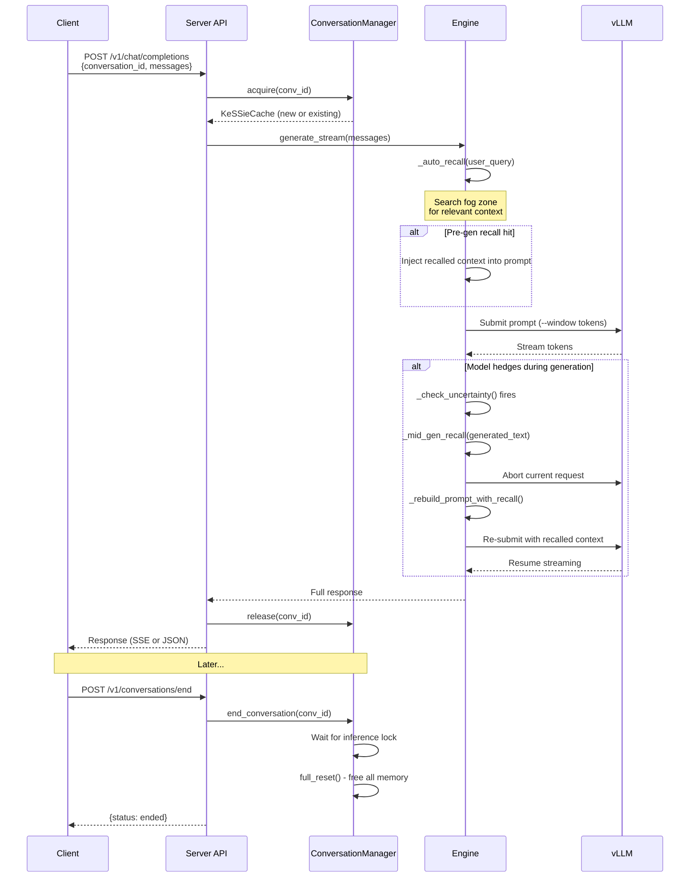

# KeSSie Experiment 3  -  Configuration Guide

## Overview

KeSSie is a fog-of-war inference engine that extends any model's context window to millions of tokens through semantic recall. The model operates within its native `--window` (e.g. 131K), while KeSSie maintains a per-conversation cache (`--kessie-cache-size`) of up to tens of millions of tokens. When the model needs context beyond its window, KeSSie recalls it  -  either before generation (pre-gen recall) or mid-generation when the model signals uncertainty.

The server supports multiple simultaneous conversations, each with its own isolated cache. Clients treat `--kessie-cache-size` as their effective context window.

## Quick Start

```bash
# Single model, 4 GPUs, 10M token conversations, 4 simultaneous users
python kessie_exp3.py serve \
  --model ./qwen_VL_32B \
  --backend vllm \
  --gpus 4 \
  --window 131072 \
  --kv-cache-dtype fp8_e5m2 \
  --kessie-cache-size 10000000 \
  --conversation-threads 4 \
  --conversation-queue 64 \
  --port 8200
```

## Core Parameters

### Model Configuration

| Flag | Default | Description |
|------|---------|-------------|
| `--model` | `Qwen/Qwen3-0.6B` | Model path or HuggingFace name |
| `--backend` | `hf` | `hf` (HuggingFace) or `vllm` (recommended for production) |
| `--gpus` | `4` | Number of GPUs for tensor parallelism |
| `--dtype` | `bfloat16` | Model dtype |
| `--window` | `4096` | Model context window size. **Set this to the model's max context length** (e.g. 131072 for Qwen2.5-VL-32B) |
| `--max-generation` | `4096` | Max tokens per response |
| `--max-model-len` | auto | vLLM max model length override |
| `--kv-cache-dtype` | auto | KV cache dtype: `fp8_e5m2`, `fp8_e4m3fn`, `float16` |

### KeSSie Cache (The Key Parameters)

| Flag | Default | Description |
|------|---------|-------------|
| `--kessie-cache-size` | `10000000` | **Max tokens per conversation cache.** This is the effective context window clients see. Each conversation independently stores up to this many tokens of history with semantic indexing for recall. |
| `--window` | `4096` | **The model's actual context window.** Must match `--max-model-len`. KeSSie manages the gap between `--window` and `--kessie-cache-size` through fog-of-war attention and semantic recall. |

**The relationship:** `--window` is what the GPU sees per inference. `--kessie-cache-size` is what the conversation remembers. KeSSie bridges them.

```
Client sees:     |<---- kessie-cache-size (10M tokens) ---->|
Model sees:      |<-- window (131K) -->|
KeSSie manages:  |<--- fog zone --->|<-- clear zone -->|
                 recalled on demand    active attention
```

### Concurrency & Multi-Tenancy

| Flag | Default | Description |
|------|---------|-------------|
| `--conversation-threads` | `4` | **Max simultaneous active conversations.** Each thread holds one conversation's generation. Set based on GPU memory  -  each active conversation consumes `--window` worth of KV cache. |
| `--conversation-queue` | `64` | **Max queued conversations** waiting for a thread. Requests beyond threads+queue get HTTP 503. |

**Eviction model:** Caches are evicted on explicit close (`POST /v1/conversations/end`). If inference is running, close waits for it to finish. When the last conversation ends, all memory is freed via `gc.collect()`. There is no idle timeout  -  the client owns the lifecycle.

**Client contract:** On reconnect (after eviction or server restart), the client resends conversation history. The `/v1/models` endpoint announces `max_model_len` = `kessie-cache-size`, so the client knows how much history to retain and resend.

```bash
# Client discovers effective context window
curl http://localhost:8200/v1/models
# Returns: {"data": [{"max_model_len": 10000000, "window": 131072, ...}]}
# Client stores up to 10M tokens of history, resends on reconnect
```

**Memory planning:**
```
Active GPU memory ~ conversation-threads x window x kv_per_token x layers
Active CPU memory ~ conversation-threads x kessie-cache-size x 4 bytes (token store)
                   + conversation-threads x (kessie-cache-size/128) x 1KB (index)
```

**Example: 4 threads, 10M cache, 131K window, 32B model:**
- GPU: 4 x 131K KV windows + model weights
- CPU per conversation: ~38MB tokens + ~76MB index = ~114MB
- CPU total: 4 x 114MB = ~456MB active (freed on conversation end)

### Fog-of-War

| Flag | Default | Description |
|------|---------|-------------|
| `--fog-alpha` | `0.5` | Fog decay strength. Higher = more aggressive fogging of old context. 0 = disabled. |

## API

### Chat Completions (OpenAI-compatible)

```bash
curl -X POST http://localhost:8200/v1/chat/completions \
  -H "Content-Type: application/json" \
  -d '{
    "messages": [{"role": "user", "content": "Hello"}],
    "conversation_id": "user-123-session-abc",
    "stream": true
  }'
```

**`conversation_id`** (optional, default: `"default"`): Routes to an isolated KeSSie cache. Same ID = same conversation history. Different IDs = fully isolated contexts.

The client is responsible for:
- Generating unique `conversation_id` per conversation session
- Ending conversations when done (frees memory)
- Refilling context if a cache was evicted (idle timeout or server restart)

### End Conversation

```bash
curl -X POST http://localhost:8200/v1/conversations/end \
  -H "Content-Type: application/json" \
  -d '{"conversation_id": "user-123-session-abc"}'
```

Immediately evicts the cache. When all conversations end, all memory is freed.

### List Active Conversations

```bash
curl -X POST http://localhost:8200/v1/conversations/list
```

Returns:
```json
{
  "conversations": [
    {
      "conversation_id": "user-123-session-abc",
      "tokens": 4521000,
      "turns": 847,
      "index_entries": 35320,
      "idle_seconds": 12.3
    }
  ],
  "stats": {
    "active_conversations": 1,
    "max_threads": 4,
    "max_queue": 64,
    "cache_size_per_conversation": 10000000,
    "total_conversations": 15,
    "total_evictions": 14,
    "cache_hits": 230,
    "cache_misses": 15,
    "active_tokens": 4521000,
    "active_index_entries": 35320,
    "active_memory_mb": 45.2
  }
}
```

### Health Check

```bash
curl http://localhost:8200/health
```

Includes conversation manager stats, cache stats, knowledge store counts, and FAISS index status.

## Cache Lifecycle

```
Client queries /v1/models
    - Gets max_model_len (= kessie-cache-size)
    - Client knows how much history to retain locally

Client connects with conversation_id
    - ConversationManager.acquire()
    - New cache created (cache miss) or existing cache reused (cache hit)
    - Per-conversation lock acquired (prevents eviction during inference)
    - Thread semaphore acquired (blocks if all threads busy, queues up)
    
Generation runs
    - Engine uses this conversation's KeSSieCache
    - Tokens appended to cache, index updated
    - Pre-gen and mid-gen recall search THIS conversation's history
    
Generation completes
    - Per-conversation lock released
    - ConversationManager.release()
    - Thread slot freed, next queued request proceeds
    - Cache stays in memory for next request
    
Client ends conversation
    - POST /v1/conversations/end
    - Waits for any active inference to finish (per-conv lock)
    - full_reset(): conversation tokens, index, KV cache all freed
    - When last conversation ends: gc.collect(), zero memory held
    
Client reconnects (after eviction or restart)
    - Sends full conversation history (up to max_model_len tokens)
    - KeSSie parses into KV cache + conversation store + semantic index
    - Conversation resumes from where it left off
```

## Production Configurations

### Small (1 GPU, personal use)
```bash
python kessie_exp3.py serve \
  --model ./model --backend vllm --gpus 1 \
  --window 32768 \
  --kessie-cache-size 1000000 \
  --conversation-threads 1 \
  --conversation-queue 4
```

### Medium (4 GPUs, team of 4)
```bash
python kessie_exp3.py serve \
  --model ./model --backend vllm --gpus 4 \
  --window 131072 --kv-cache-dtype fp8_e5m2 \
  --kessie-cache-size 10000000 \
  --conversation-threads 4 \
  --conversation-queue 16
```

### Large (8 GPUs, multi-user service)
```bash
python kessie_exp3.py serve \
  --model ./model --backend vllm --gpus 8 \
  --window 131072 --kv-cache-dtype fp8_e5m2 \
  --gpu-memory-utilization 0.92 \
  --kessie-cache-size 50000000 \
  --conversation-threads 8 \
  --conversation-queue 128
```

## Architecture

```mermaid
graph TB
    subgraph Clients
        C1[Client A<br/>conversation_id: abc]
        C2[Client B<br/>conversation_id: def]
        C3[Client C<br/>conversation_id: ghi]
        CQ[Client D<br/>queued]
    end

    subgraph Server["KeSSie Server"]
        direction TB
        API["/v1/chat/completions<br/>/v1/conversations/end<br/>/v1/conversations/list"]

        subgraph ConvMgr["ConversationManager"]
            direction LR
            TS["Thread Semaphore<br/>(--conversation-threads)"]
            QS["Queue Semaphore<br/>(--conversation-queue)"]
        end

        subgraph Caches["Per-Conversation Caches"]
            direction TB
            subgraph Cache1["Cache: abc"]
                CT1["Conversation Tokens<br/>up to --kessie-cache-size"]
                IX1["Semantic Index<br/>embedding per 128 tokens"]
                TB1["Turn Boundaries<br/>role + position"]
            end
            subgraph Cache2["Cache: def"]
                CT2["Conversation Tokens"]
                IX2["Semantic Index"]
                TB2["Turn Boundaries"]
            end
        end

        subgraph Engine["LibrarianEngine"]
            direction TB
            BP["_build_prompt()<br/>fog windowing"]

            subgraph Recall["Recall Pipeline"]
                direction LR
                AR["_auto_recall()<br/>pre-gen search"]
                MR["_mid_gen_recall()<br/>hedge detection"]
            end

            subgraph Gen["Generation"]
                direction TB
                VLLM["vLLM / HF Backend<br/>--window context"]
                FOG["Fog-of-War Attention<br/>clear zone + fog zone"]
            end

            RB["_rebuild_prompt_with_recall()<br/>abort + inject + resume"]
        end

        KS["KnowledgeStore<br/>FAISS + SQLite"]
    end

    subgraph GPU["GPU (--gpus)"]
        MW["Model Weights"]
        KV["KV Cache<br/>--window tokens<br/>--kv-cache-dtype"]
    end

    subgraph CPU["CPU RAM"]
        TS2["Token Stores<br/>~38MB per 10M tokens"]
        IDX["Embedding Index<br/>~76MB per 10M tokens"]
    end

    C1 & C2 & C3 --> API
    CQ -.->|queued| API
    API --> ConvMgr
    ConvMgr -->|acquire/release| Caches
    Caches --> Engine
    Engine --> VLLM
    AR -->|search fog zone| Caches
    MR -->|search fog zone| Caches
    MR -->|hedge detected| RB
    RB -->|re-submit| VLLM
    VLLM --> GPU
    CT1 & CT2 --> CPU
    IX1 & IX2 --> CPU
    Engine --> KS

    style Cache1 fill:#1a3a1a,stroke:#4a4
    style Cache2 fill:#1a1a3a,stroke:#44a
    style GPU fill:#3a1a1a,stroke:#a44
    style Recall fill:#3a3a1a,stroke:#aa4
```



### Request Flow



## How It Works

1. **Client sends messages** with a `conversation_id`. KeSSie routes to that conversation's isolated cache.

2. **Context window management**: Messages are tokenized and stored in the KeSSie cache (up to `--kessie-cache-size`). Only the most recent `--window` tokens go to the GPU. Older tokens enter the "fog zone"  -  still in the cache, semantically indexed, but not in active attention.

3. **Pre-generation recall**: Before inference, KeSSie searches the fog zone for context relevant to the user's query. Found context is injected into the prompt as a system message with positional annotation (turn number, token distance).

4. **Mid-generation recall**: During streaming, if the model shows uncertainty (hedging phrases like "if I recall", "let me see if I can remember"), KeSSie pauses generation, searches the fog zone with the generated text as query, injects the recalled context, and resumes. The model continues with the correct information.

5. **Cache eviction**: When a conversation ends or goes idle, its entire cache is freed. When no conversations are active, all memory is released. Clients refill context on reconnect.

## Environment Variables

```bash
# GPU selection
HIP_VISIBLE_DEVICES=0,1,2,3   # AMD
CUDA_VISIBLE_DEVICES=0,1,2,3  # NVIDIA
```

## CLI Mode

For single-user interactive use:
```bash
python kessie_exp3.py chat \
  --model ./model --backend vllm --gpus 4 \
  --window 131072 --kessie-cache-size 10000000
```

Commands: `/topics`, `/store <topic> <key> <value>`, `/search <query>`, `/stats`, `/quit`